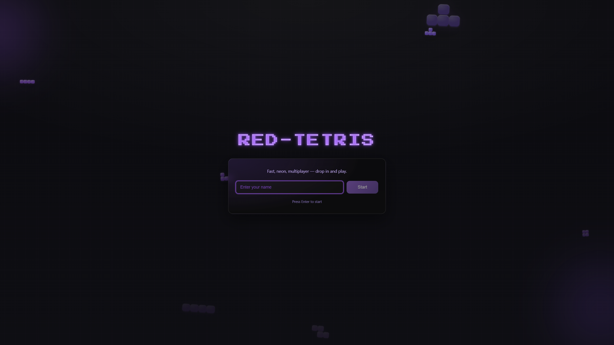
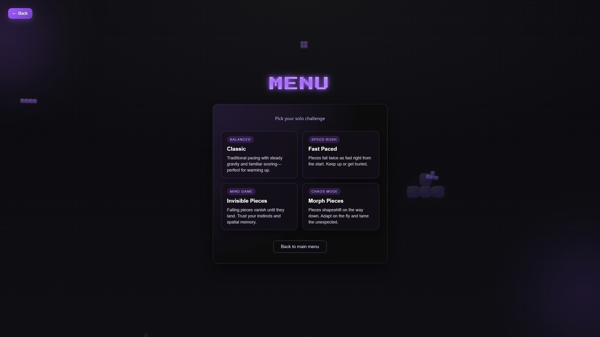
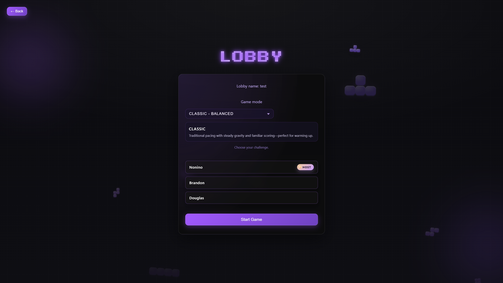
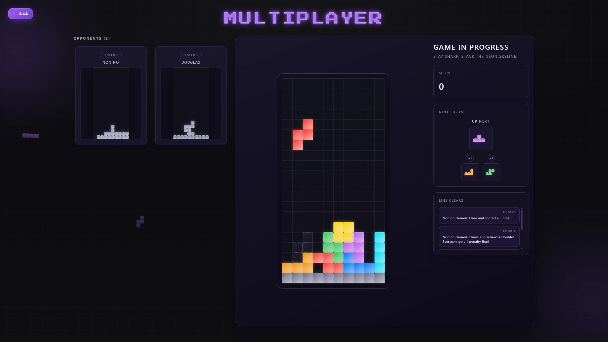
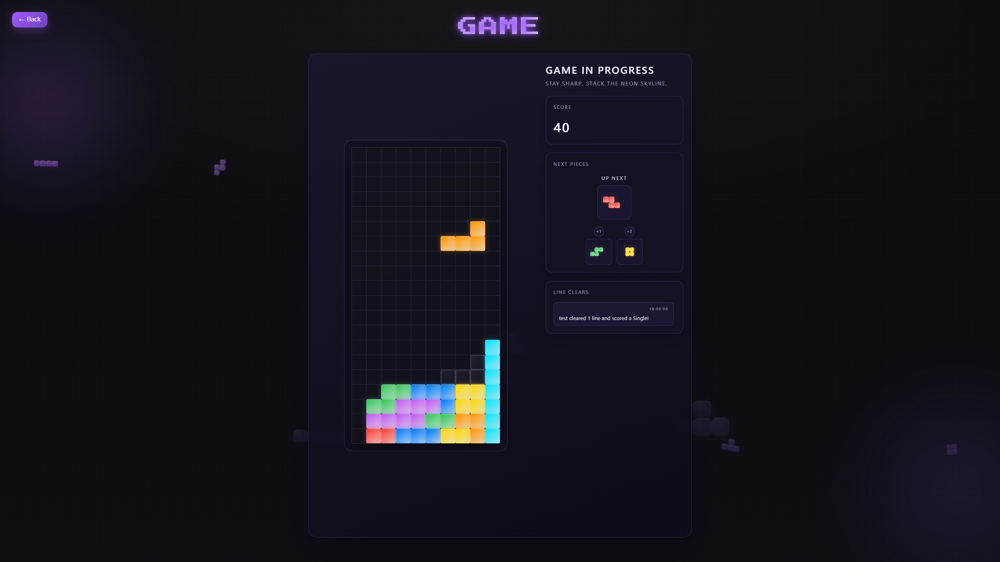
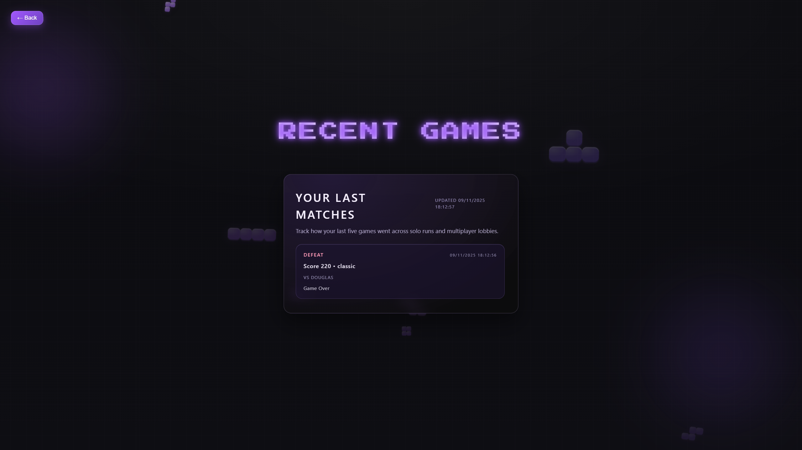

# Red Tetris

> Multiplayer-first Tetris built for the 42 network — fast Socket.IO backend, sleek Vite/React frontend, and persistent player history backed by PostgreSQL.

## Table of Contents
- [Overview](#overview)
- [Feature Highlights](#feature-highlights)
- [Architecture](#architecture)
- [Getting Started](#getting-started)
  - [Prerequisites](#prerequisites)
  - [Install Dependencies](#install-dependencies)
  - [Environment Variables](#environment-variables)
  - [Run the Stack Locally](#run-the-stack-locally)
- [Remote Start](#remote-start)
- [Docker Workflow](#docker-workflow)
- [Quality & Tooling](#quality--tooling)
- [Release & Versioning](#release--versioning)
- [Further Reading](#further-reading)

## Overview
Red Tetris is a full-stack remake of the classic game with a focus on social play. Players can spin up private lobbies, spectate friends, or speed-run solo “journeys.” The `backend/` service implements the game engine, line-clear logic, and persistence layer, while the `frontend/` Vite app handles routing, lobby UX, notifications, and the arena views (grid, specter boards, next queue, and live line-clear feed). PostgreSQL keeps the latest five results per player so the `/history` view can recap recent runs.

The project is still evolving, but the gameplay loop, lobby flow, stats storage, and CI checks are already in place.

## Feature Highlights
- **Real-time multiplayer** powered by Socket.IO rooms, owner hand-offs, and configurable game modes (`classic`, `fast-paced`, `invisible-falling-pieces`, `morph-falling-pieces`).
- **Solo Journey mode** auto-starts a private arena with your preferred difficulty and routes you straight to gameplay.
- **Lobby management** with owner-only controls, mode previews, accessible form labels, and animated background/notification system to keep players informed.
- **Spectator view & specter columns** so eliminated players can keep watching opponents and follow the line-clear log.
- **Persistent player history** stored in PostgreSQL via [`backend/statistics.js`](backend/statistics.js), surfaced in the `/history` page through Redux slices.
- **Automation-friendly tooling**: GitHub Actions CI, Makefile helpers, Docker Compose stack, and release automation with `standard-version`.

## Screenshots
**Home & onboarding**


**Solo Journey selection**


**Lobby setup**


**Multiplayer arena**


**In-game HUD**


**Recent games history**


## Architecture
```
.
├── backend/   # Node.js + Socket.IO game server, PostgreSQL stats, Jest specs
├── frontend/  # React 18 + Vite + Redux Toolkit + styled-components UI
├── docker-compose.yml
├── Makefile   # Developer ergonomics (env, deps, lint, tests, docker, etc.)
└── .github/workflows/ci.yml
```

## Getting Started

### Prerequisites
- Node.js 20.x (matches the CI matrix in `.github/workflows/ci.yml`)
- npm 10.x (ships with Node 20)
- Docker Desktop / Docker Engine (optional but recommended for parity)

### Install Dependencies
From the repo root you can install everything with one target:

```bash
make deps          # runs npm install in frontend/ and backend/
```

Or install manually if you prefer:

```bash
cd frontend  && npm install
cd ../backend && npm install
```

### Environment Variables
1. Copy the template and let the Makefile inject the host name used by Vite:
   ```bash
   make env                # creates .env from .env.template when missing
   ```
2. Fill in the Postgres credentials (`POSTGRES_USER`, `POSTGRES_PASSWORD`, `POSTGRES_DB`) and tweak `VITE_SOCKET_URL` for your setup.
3. Optional backend knobs:
   - `PORT` (defaults to `3000`)
   - `SOCKET_ALLOWED_ORIGINS` (comma-separated list) to lock down CORS origins.
   - `POSTGRES_URI` if you want to override the host/port combo defined above.

### Run the Stack Locally
Backend (Node + Socket.IO + PostgreSQL driver):

```bash
cd backend
npm start                         # listens on :3000
```

Frontend (Vite dev server + React Fast Refresh):

```bash
cd frontend
npm run dev                       # serves on http://localhost:5173
```

Key routes:
- `/` — username onboarding + animated background.
- `/menu` — choose Solo journey vs Multiplayer.
- `/join` — enter or create a lobby name (owners pick the mode, others wait).
- `/history` — last five games pulled from the stats slice/PostgreSQL.
- `/:room/:player_name` — arena router that decides Solo, Multi, or Spectator view.

PostgreSQL stores player history in the `statistics` table (see `backend/statistics.js`). When running locally without Docker you can point `POSTGRES_URI` at any reachable instance.

## Remote Start
Need to host Red Tetris on a remote VM or via SSH? Use the familiar commands with a few tweaks so browsers can reach the dev servers.

1. **Provision the machine**
   ```bash
   git clone https://github.com/okbrandon/red-tetris.git
   cd red-tetris
   make env
   make deps
   ```
   Update `.env` with the help of `.env.template`.

2. **Start the services**
   - Run `make docker-build` and `make docker-up` on the remote host instead and skip the manual servers.

## Docker Workflow
Everything can also run in containers (backend, frontend, PostgreSQL):

```bash
make docker-up         # builds images and starts the stack
make docker-logs       # tails all services
make docker-down       # stop containers (volumes preserved)
make docker-reset      # stop containers and wipe the Postgres volume
```

`docker-compose.yml` exposes:
- `frontend` on `http://localhost:8080`
- `backend` on `http://localhost:3000`

The Postgres data lives in the `postgres-data` named volume so you can wipe it independently with `make docker-clean-volumes`.

## Further Reading
- [`CONTRIBUTING.md`](CONTRIBUTING.md) — branching model, commit message style, and PR checklist.
- [`CHANGELOG.md`](CHANGELOG.md) — history of notable fixes and features.
- [`docker-compose.yml`](docker-compose.yml) — environment variables consumed by each service.
- [`frontend/README.md`](frontend/README.md) — the base Vite docs if you are new to the tooling.

Have fun stacking red tetrominoes! Contributions, bug reports, and play-test feedback are very welcome. Dive into an issue, fire up a lobby, and let us know what breaks.
